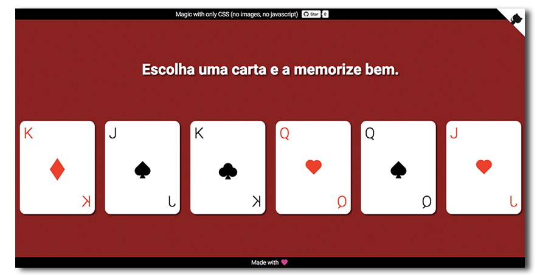

# CSS Magic

> An illusion created only with CSS -  [afonsopacifer.github.io/css-magic/](http://afonsopacifer.github.io/css-magic/)

## [See the magic](http://afonsopacifer.github.io/css-magic/)

## Features
- Only HTML and **CSS** (No images and no Javascript)
- Responsive
- Offline first
- Magic

## Contributing
Want to contribute? [Follow these recommendations](https://github.com/afonsopacifer/css-magic/blob/gh-pages/CONTRIBUTING.md).

## License
[MIT License](https://github.com/afonsopacifer/css-magic/blob/gh-pages/LICENSE.md) © [Afonso Pacifer](http://afonsopacifer.com/)
